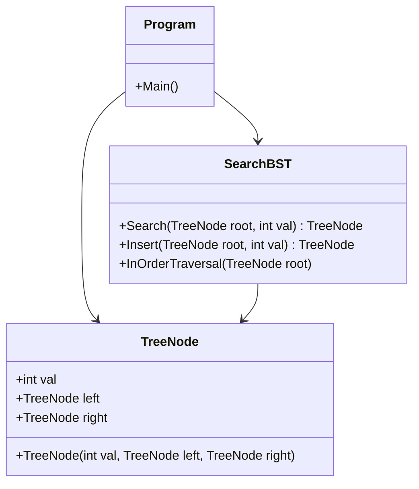
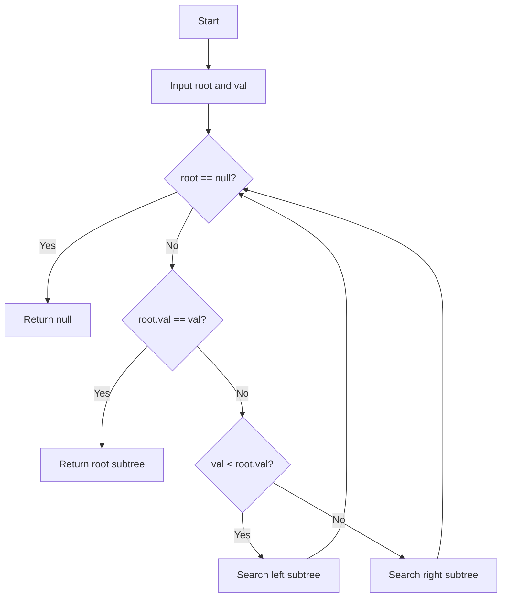
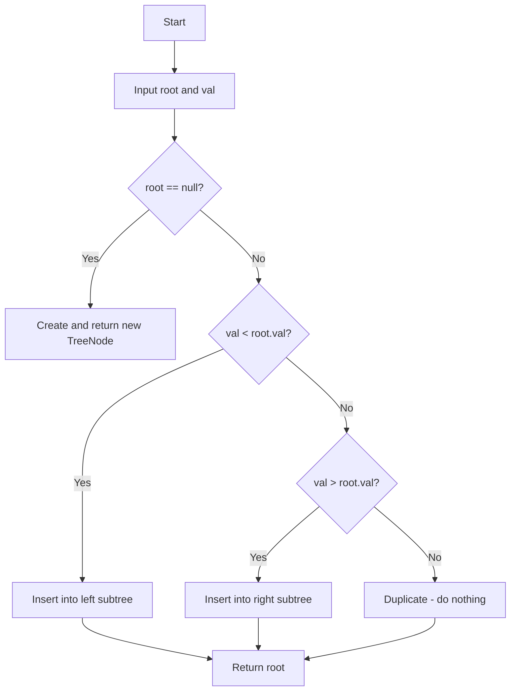
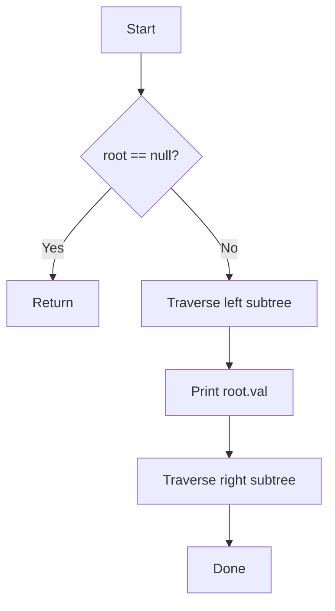

<p align="center">
  
</p>

<p align="center">
  
  
  <a href="https://github.com/brovy23-GD/Rovy_Assignment_7.3_Search_BST">
    
  </a>
  <a href="https://github.com/brovy23-GD/Rovy_Assignment_7.3_Search_BST">
    
  </a>
  
</p>

# Rovy Assignment 7.3

C# console application implementing a Binary Search Tree (BST) with recursive Search, Insert, and InOrder Traversal completed as part of MSSA coursework. This project demonstrates recursive problem solving, tree traversal, and clean class-based organization in C#.

## Project Highlights

- Built in C# with separate classes for TreeNode and SearchBST to improve readability, maintainability, and modular design.
- Demonstrates core technical skills including recursion, binary search logic, tree traversal, and pointer-based node linking.
- Uses a console-driven workflow through Program.cs to build a BST, traverse it, and search for user-specified values.

## Algorithms Included

### 1) Search BST

Given the root of a Binary Search Tree and an integer val, finds the node where node.val equals val and returns the subtree rooted at that node. If the value does not exist, returns null.

Concepts demonstrated:

- Recursion
- Binary search logic
- Tree traversal
- Base case handling
- Null safety

Complexity:

- Time: O(h) where h is the height of the tree
- Space: O(h) recursive call stack

### 2) Insert BST

Recursively inserts a new value into the correct position in the BST while maintaining BST ordering properties. Ignores duplicate values.

Concepts demonstrated:

- Recursive insertion
- BST ordering rules (left < root < right)
- Node creation
- Returning updated subtree roots

Complexity:

- Time: O(h)
- Space: O(h)

### 3) InOrder Traversal

Traverses the BST in Left → Node → Right order, printing all values in ascending sorted order.

Concepts demonstrated:

- Recursive tree traversal
- In-order traversal pattern
- Base case with null check

Complexity:

- Time: O(n)
- Space: O(h)

## Tech Stack

- C#
- .NET / Visual Studio
- Console application
- Algorithms and Data Structures fundamentals

## Project Structure

```text
Rovy_Assignment_7.3_Search_BST/
|-- Program.cs
|-- TreeNode.cs
|-- SearchBST.cs
`-- README.md
```

## UML Class Diagram



## Algorithm Flowcharts

### 1) Search BST Flowchart



### 2) Insert BST Flowchart



### 3) InOrder Traversal Flowchart



## Trace Tables

### 1) Search BST Trace Table Example

Input

```text
BST root = 8, search val = 6
```

| Step | Current Node | Action                        |
|------|-------------|-------------------------------|
| 1    | 8           | 6 < 8, go left                |
| 2    | 3           | 6 > 3, go right               |
| 3    | 6           | 6 == 6, return subtree at 6   |

### 2) Insert BST Trace Table Example

Input

```text
Insert values: 8, 3, 1, 6, 14, 4, 7, 13
```

| Step | Value Inserted | Position         |
|------|---------------|------------------|
| 1    | 8             | Root             |
| 2    | 3             | Left of 8        |
| 3    | 1             | Left of 3        |
| 4    | 6             | Right of 3       |
| 5    | 14            | Right of 8       |
| 6    | 4             | Left of 6        |
| 7    | 7             | Right of 6       |
| 8    | 13            | Left of 14       |

### 3) InOrder Traversal Trace Table Example

Input

```text
BST built from: 8, 3, 1, 6, 14, 4, 7, 13
```

| Step | Node Visited | Output |
|------|-------------|--------|
| 1    | 1           | 1      |
| 2    | 3           | 3      |
| 3    | 4           | 4      |
| 4    | 6           | 6      |
| 5    | 7           | 7      |
| 6    | 8           | 8      |
| 7    | 13          | 13     |
| 8    | 14          | 14     |

## Time and Space Complexity Summary

| Algorithm          | Time Complexity | Space Complexity | Notes                              |
|--------------------|-----------------|------------------|------------------------------------|
| Search BST         | O(h)            | O(h)             | h = height of tree                 |
| Insert BST         | O(h)            | O(h)             | Recursive call stack               |
| InOrder Traversal  | O(n)            | O(h)             | Visits every node once             |

## How to Run

1. Open the solution in Visual Studio.
2. Build the project.
3. Run the application.
4. The console will:
   - Display the in-order traversal of the BST.
   - Prompt you to enter a value to search for.
   - Return whether the value was found or not found in the BST.

## Sample Output

### InOrder Traversal

Output

```text
In-order traversal of the BST (sorted):
1 3 4 6 7 8 13 14
```

### Search BST

Input

```text
6
```

Output

```text
Value 6 found in the BST.
```

Input

```text
10
```

Output

```text
Value 10 NOT found in the BST.
```

## What This Project Shows

This project showcases my ability to write organized, beginner-to-intermediate C# code with a focus on recursive algorithmic thinking, tree data structures, and clean separation of concerns across classes. It also reflects my MSSA training in foundational software development concepts such as recursion, binary search logic, pointer-based node structures, and console-based user interaction.

## Next Improvements

Planned enhancements for future iterations:

- Add a Delete method to remove nodes from the BST.
- Add input validation for invalid or empty console entries.
- Display the returned subtree visually in the console.
- Add unit tests for Search, Insert, and Traversal methods.
- Implement an iterative version of Search for comparison.

## Version

v1.0.0

Initial release featuring a complete Binary Search Tree implementation with Search, Insert, and InOrder Traversal with documentation and console-based execution flow.

## License

MIT License
